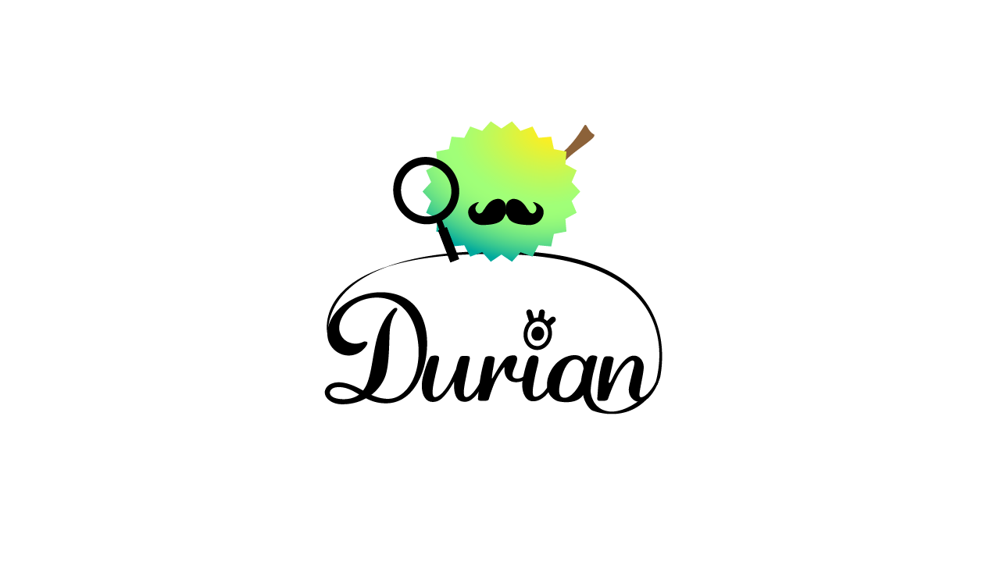
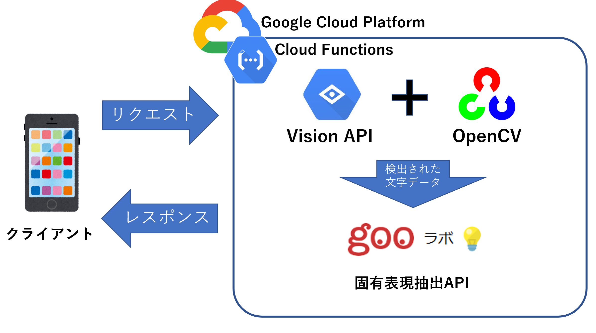

# Durian

画像をクリックするとyoutubeの動画にとびます

## 製品概要
### Privacy × Tech　～SNS写真投稿をセキュアに～

### 背景
2019年10月8日、さいたま市の男が、SNSに投稿された女性の写真から瞳に映った景色の場所を特定し、女性にわいせつな行為を行ったというニュースが報道された。（※１）
我々はこの事件を知り、SNSの写真投稿に関する課題に興味を持った。

広く現代社会に浸透したSNSだが、昨今ではSNSの中でもInstagram等の、写真を共有する形のSNSが人気となっている。これらのメリットは、視覚的な情報が与えられることで、文字が主体のSNSよりも直感的に情報収集できる点だ。しかし、このような恩恵がある一方で、写真主体の発信にはデメリットも存在する。そのデメリットとは、写真という媒体の性質上、情報発信者の意図しない情報が映り込んでしまう可能性があることだ。上述した報道が、このデメリットを悪用した一例だと言える。個人情報の漏洩は写真の加工によって防ぐことができるが、一つ一つの写真を目視し加工するとなると、多くの時間を要してしまう。
以上のような事実から我々は、写真に含まれる個人情報の加工処理を自動的にできるサービスがあれば、不本意な個人情報の漏洩を減らすことができると考えた。その結果、写真中の個人情報検出・画像加工までを自動で行うアプリケーションである「Durian」を開発した。

> ※１：　（瞳に映った景色で住所特定か　わいせつ事件で男を逮捕, 
https://www.sankei.com/smp/affairs/news/191008/afr1910080047-s1.html, 
2019年10月26日　時点）

### 製品説明
Durianは、写真に含まれる情報をAIによって検出し、その結果に応じて、個人が特定される危険性の高い箇所を自動加工するアプリケーションである.

#### ◆Durian利用の基本的な流れ
1．タイトル画面から『写真を撮影するボタン』または『写真を選択するボタン』のいずれかを選択し、写真をサーバにポストする。

2．サーバにてポストされた写真が解析される。

3．２の解析結果・解析情報を画面に表示する。

4．『モザイクをかける』ボタンを押すことで、写真の加工を行う。

5．加工された写真を保存し、タイトル画面へ戻る

#### ◆Durianの付随機能
上述した基本的な流れの他に、Durianには端末に保存された写真の中から危険性のある写真を検出し、端末の通知画面にサジェストする機能が備わっている。この機能の流れは、以下の通りである。

1．１日（２４時間）毎に、デバイス自体に保存されている写真が自動解析されるようになっている。

2．自動解析された写真の中で危険性のある写真が含まれていると、端末の通知画面に表示される。

3．通知をタップすると、『Durian利用の基本的な流れ』の１の画面に遷移する。（写真はサジェストされた写真が入っている）

4．『Durian利用の基本的な流れ』の2~5の流れと同様

なおこの付随機能は、端末の設定からオフにすることが可能である。

#### ◆Durianの特徴・メリット

#### 1. 特長1  ユーザー目線から作成したUI
多くのスマホユーザーに使用してもらうことを想定し、UIのシンプル化に力を入れた。画面遷移をできるだけ少なくする、ボタンの数を多く作らない、解析処理の待ち時間にローディングのアニメーションを表示する等、ユーザビリティを意識したUI設計を心掛けた。

#### 2. 特長2  自動的に危険性の検出ができる
AIによって写真に含まれる情報が検出され、さらにそれらの情報を隠すべきか隠さなくとも良いかを自動で判断してくれる。
#### 3. 特長3  写真中の情報、統計情報の表示
写真から読み取れる情報を枠線やグラフ等で表示することで、自らの写真データにどれほどの危険性が含まれているのかを視覚的に理解できる。

### 解決出来ること
1．意図しない個人情報の漏洩を避け、より安全性の高いSNSの利用ができるようになる。

2．写真データに含まれる個人情報の存在を自分ごとに感じさせることで、ユーザーのネットリテラシーの醸成に寄与できる。

3．写真の加工処理にかかる時間的負担を減らすことができる。

### 今後の展望
#### ●短期的展望

- 複数の写真を一斉に処理できるようにしたいと考える。現段階では一回の操作につき一枚の写真しか解析、加工ができないため、多くの写真を加工する際には手間がかかる。この欠点を解消すれば、より使いやすいプロダクトになると考える。
- 解析情報のバリエーションを豊かにすることで、SNSへの写真投稿に対するユーザーの意識を高めたい。現時点で出ているアイデアとしては、検出箇所の類語をサジェストして個人特定が原因で起こった事件の検索を促す機能、などである。これらを導入することにより、ユーザーのネットリテラシーの更なる向上を促したい。

#### ●中期的展望
- 精度の高い独自学習モデルにて学習をさせ、より精度の高い検出ができるようになりたいと考える。今回は画像の解析処理をGoogleのVision APIに頼ってしまったが、これから機械学習に関する知見を深め、いずれはこのアプリケーションの目的に最適化された機械学習モデルを作成したい。

#### ●長期的な展望
- 動画への対応が必要だと考える。『YouTube』『Tiktok』等の動画メディアが勢いづいている昨今、動画にも個人の特定につながる情報が映り込む可能性がある。５Gの発達による動画視聴・配信の高速化が予想されるため、動画中に映り込んだ個人情報の検出、加工処理も行えるようにしたい。また、リアルタイムで流れる動画（配信）も、同様の処理が可能であれば理想的だと考える。

## 開発内容・開発技術
### システム図
サーバサイドの処理は以下の図のようになります。

### 活用した技術
#### 使用言語
* Python3.7
* Kotlin1.3.50

#### API・データ
* gooラボ 固有表現抽出API
* Vision API

#### フレームワーク・ライブラリ・モジュール
* OpenCV
* Flask
* MP Android Chart

#### デバイス
* Androidスマートフォン

#### その他プラットフォーム
* Google Cloud Platform（Cloud Functions, Google Cloud Storage）
* Android Studio

### 独自開発技術（Hack Dayで開発したもの）
#### 2日間に開発した独自の機能・技術
プロダクトの全実装が、Hack Dayにて行われたものである。
具体的な事項を以下に記す。
- Androidクライアント（UI等）
- 写真中の個人情報を、Vision APIを用いて検出する処理
- 検出した文字列の危険性を、gooラボの固有表現抽出APIを用いて判定する処理
- 写真から読み取れた情報とこれまでの検出の統計情報を表示する処理
- デバイスに保存されている写真を自動的に判定し、判定結果を通知する処理

